# Introduction

While many may recognize F1 as the pinnacle of motorsport, fewer are familiar with the nuances that define competition in this high-stakes, billion-dollar industry. To appreciate the insights our analysis provides, we first need to break down the essential components of the sport: how success is measured, what factors influence race outcomes, and why teams and drivers make strategic decisions throughout a season.

 

# Rise in Popularity

:::: columns

::: {.column width="45%" style="padding-right: 10px;"}
Formula 1 has experienced a remarkable surge in global popularity over the past decade, evolving from a niche motorsport into a mainstream global phenomenon. A significant catalyst in this rise has been Netflix’s original series *Formula 1: Drive to Survive*, which brought the sport into the spotlight for new audiences worldwide. By humanizing drivers, amplifying rivalries, and unveiling the drama behind the scenes, the series attracted fresh viewers and deepened the connection with existing fans.
:::

::: {.column width="45%" style="padding-left: 10px;"}

  
  
Poster for Season 7 of Netflix's Formula 1: Drive to Survive series

:::

::::

<figure style = "display: flex; flex-direction: column; align-items: center; width: 100%">
  <iframe src = "./img/google_searches_over_time.html" width = "85%" height = "490px" frameborder = "0" scrolling = "no" style = "border: none; overflow: hidden;"></iframe>
  <figcaption style = "margin-top: 0.5rem;"><strong>Relative Google search popularity for "Formula 1" over the last 10 years.</strong></figcaption>
</figure>

The line plot above provides further evidence of this trend, showcasing Google search popularity for the term "Formula 1" over the last 10 years. The data is indexed, with a value of 100 indicating peak search interest, while 50 signifies half the peak popularity, and 0 suggests insufficient data. The chart highlights how Formula 1 has consistently grown in prominence, with substantial spikes in search interest corresponding to pivotal moments, such as the release of the Netflix series or dramatic events in recent championship battles. This visual representation displays the sport's increasing global reach and the rising curiosity among fans eager to engage with Formula 1 on and off the track.

 

# Understanding Formula 1

F1 is a global racing championship where elite drivers and teams, also referred to as constructors, compete across a series of Grand Prix events. The season operates under a championship format, with points awarded based on finishing position in each race. These points contribute to two key titles:

 

# Championship Structure

 

::::{.cr-section}
<strong style="color: #FF1E00;">The Driver's Championship</strong> is given to the driver with the most points at the end of the season. Points are awarded based on finishing position in each race. For example, 25 points for first place, 18 for second, and 15 for third.
@cr-Championship1

<strong style="color: #FF1E00;">The Constructor's Championship</strong> is awarded to the team whose two drivers accumulate the most combined points throughout the season. The total points for both drivers are added together at the end of the season.
@cr-Championship2

:::{#cr-Championship1}
<figure style = "display: flex; flex-direction: column; align-items: center; width: 110%">
  <iframe src = "./img/2024_driver_standings_table.html" width = "100%" height = "500px" frameborder = "0" scrolling = "no" style = "border: none; overflow: hidden;"></iframe>
  <figcaption style = "margin-top: 0.5rem;"><strong>Table 1: 2024 Final Driver's Championship Standings (Top 10 Drivers).</strong></figcaption>
</figure>
:::

:::{#cr-Championship2}
<figure style = "display: flex; flex-direction: column; align-items: center; width: 110%">
  <iframe src = "./img/2024_constructor_standings_table.html" width = "100%" height = "500px" frameborder = "0" scrolling = "no" style = "border: none; overflow: hidden;"></iframe>
  <figcaption style = "margin-top: 0.5rem;"><strong>Table 2: 2024 Final Constructor's Championship Standings.</strong></figcaption>
</figure>
:::
::::

Over the past decade, Ferrari, Mercedes, and Red Bull have consistently secured positions within the top 3 of the Formula 1 constructor's championship, showcasing their established excellence in the sport. This project seeks to explore the track-specific, team-specific, and driver-specific factors and decisions that contribute to such success, aiming to uncover the strategies and influences that drive performance at this elite level. In the chart below, hover over and click any colored constructor podium cell to see counts of podium finishes per year for the chosen constructor.

 

<figure style="text-align: center;">
  <iframe 
    src = "./img/final_positions_chart.html" 
    width = "900px" 
    height = "900px" 
    frameborder = "0" 
    scrolling = "no" 
    style = "border: none; overflow: hidden;">
  </iframe>
  <figcaption style="margin-top: 0px; font-size: 14px; color: white;">
    Cosntructors' Championship Wins By Season Heatmap and Top 3 Finishes Count Bar Plots Linked View
  </figcaption>
</figure>

 

# 🚥 Track-Level Influences

Each circuit presents unique challenges, from tight streets in circuits like Monaco to high-speed power tracks like Monza. Variables such as turn complexity, elevation changes, climate, and surface conditions dictate car setups and racing strategies.

## A Deep Dive into F1's Most Iconic Circuits

Formula 1 is often heralded as the platinum standard of motorsport, and for good reason. Each track raced on over the course of a season presents a set of unique and nuanced challenges that teams must navigate if they wish to win. In this section, we created an interactive visualization that lets you explore five of Formula 1's most iconic circuits - each chosen to showcase different aspects of what makes F1 such a technically demanding sport.

### The Tracks: A Study of Contrasts

Our visualization focuses on five carefully selected circuits that represent a unique spectrum of the challenges faced by F1 drivers:

::::{.cr-section layout="overlay-left" data-sticky="true"}
**🇲🇨 Monaco: The Ultimate Precision Test**
 
 
Along the narrow streets of Monte Carlo, Monaco represents F1 at its most technical. In this circuit, drivers must be prepared to thread their million-dollar beasts through gaps that are no wider than the car itself. Our visualization reveals how lap performance is heavily dictated by the famous hairpin turn on the upper right hand section of the track - where drivers who misjudge the apex can find themselves being passed by cars on the inside, or lose precious time.
@cr-monaco

**🇮🇹 Monza: The Temple of Speed**
 
 
In contrast to Monaco, Italy's Monza circuit is all about pure horsepower. Known as "The Temple of Speed", this famous track consists of a long straightaway the allows drivers to conclude laps with blistering speeds. When looking at animations of the circuit, it's clear the faster teams are often better equipped to win at Monza. When selected, we can see the McLaren's Lando Norris has the fastest lap time of any driver on the circuit - thanks to both his car's superior straight line speed and his natural talent as a driver.
@cr-monza

**🇸🇬 Singapore: The Twilight Zone**
 
 
The Marina Bay Circuit represents one of F1's most physically demanding tracks. The combonation of long straights into tight corners means drivers must be prepared to experience high g-forces around turns.
@cr-singapore

**🇧🇪 Belgium: The Mountainous Test**
 
 
Belgium's Spa-Francorchamps circuit is known for its high-speed turns and steep elevation changes. This circuit is a true test of a driver's skill and car's durability, as drivers navigate through a series of fast corners and elevation changes.
@cr-belgium

**🇺🇸 Austin: Circuit of the Americas**
 
 
The Circuit of the Americas is a track that is known for its high-speed turns and long straights. This circuit is a true test of a driver's skill and car's durability, as drivers navigate through a series of fast corners and elevation changes.
@cr-austin

:::{#cr-monaco}
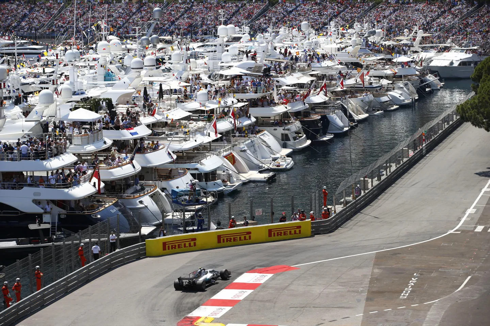{width="2000px"}
:::

:::{#cr-monza}
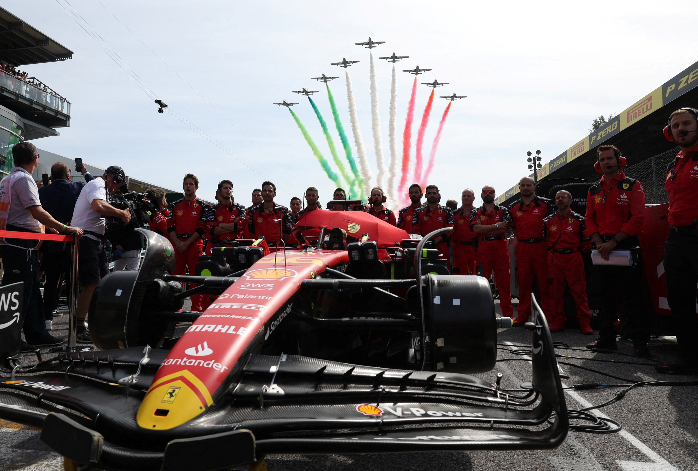
:::

:::{#cr-singapore}

:::

:::{#cr-belgium}

:::

:::{#cr-austin}
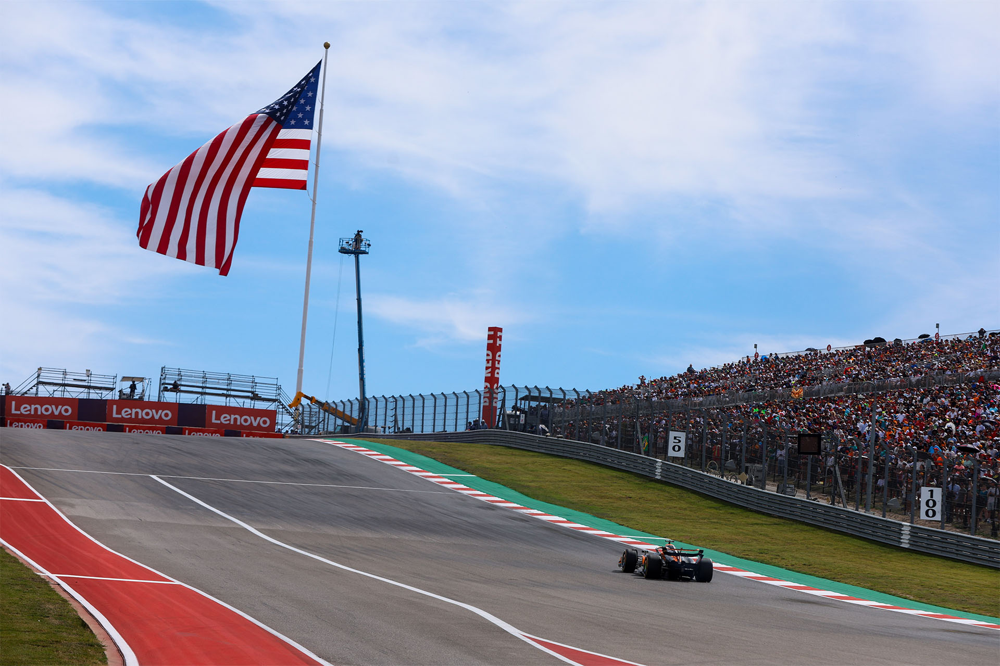
:::

::::

## Interactive Features That Tell the Story

Our visualization puts you in control of understanding each of these iconic tracks. Within it, you can:

- Select any of the five featured races (from the 2024 season)
- Choose a specific driver to focus on
- Compare their fastest and slowest laps
- Overlay the track with their lap's telemetry data, including:
  - Speed
  - Throttle %
  - Gear number
  - Braking
  - RPMs
- Once selected, you can watch an animated replay of the lap, with the selected driver marked in black and the overall fastest lap marked in gold

This level of detail helps to reveal the subtle differences in driving styles and approaches to each circuit. For example, you may notice how different drivers:

- Approach braking zones
- Manage their speed through various types of corners
- Adapt their techniques to each track's unique characteristics

You can find a personal favorite example of this animation using the following configuration:

- <strong style="color: #FF1E00;">Race:</strong> Singapore Grand Prix
- <strong style="color: #FF1E00;">Driver:</strong> Max Verstappen (Fastest)

In this comparison, we can see how Verstappen is able to capitalize on his car's superior speed to overtake Ricciardo in the first straightaway, offering him an advantage when going into turn 3. The drivers remain close until turn 7, where Verstappen appears to take a slower approach to the turn, allowing Ricciardo to gain time back. Going into the second to last straightaway, Ricciardo furher capitalizes on his well-executed turn by creating a gap between the two drivers - giving him more leeway in the final two turns, and ultimately solidifying his position as the fastest lap in the race overall.

## Why This Matters

Understanding these nuances isn't just about appreciating the technicality of the sport - it's about understanding the incredible complexity of F1. Each circuit demands a unique approach, different car setups, and different strategies. Through this visualization, we hope to provide a deeper understanding of what it takes to perform at an elite level in each of these tracks.

Whether you are a die-hard F1 fan, or just beginning to explore the sport, we hope this interactive tool helps to provide some insight into the technical brilliance required to compete at the highest level of motorsport.

Please feel free to explore the visualization below and discover your own findings. You might be surprised by what you learn!

> ***Reminder:*** For the example above we selected the fastest lap for Max Verstappen in the Singapore Grand Prix.

<iframe
  data-external="1"
  src="https://dsan5200group25.streamlit.app/?embed=true"
  width="150%"
  height="1300"
  frameborder="0"
  allowfullscreen
  style="border:none; max-width:100%; margin:0 auto; display:block;"
></iframe>

 

# Team-Level Influences

The role of the pit crew, engineers, and strategists is often under appreciated. At a Formula 1 pit stop, the team performs tasks such as changing tires, making aerodynamic adjustments, repairing damaged parts and other mechnical adjustments. In fact, there are generally 8 different tire types used during a race weekend: three dry-weather slick tires (soft, medium, and hard), intermediate tires for damp conditions, and full wet tires for heavy rain. Therefore, well-timed pit stops for tire changes and repairs can significantly affect the outcome of a race. Aerodynamics, fuel efficiency, and ongoing car development over a season are just as crucial as the driver’s skill.

 

<strong style="color: #FF1E00;">Pit Stop Timing</strong> is crucial in Formula 1 because it directly impacts a team's ability to maintain or improve their position during a race. A well-timed pit stop, taking into account factors like tire wear, track conditions, and traffic, can save valuable seconds and provide a strategic advantage. Conversely, a poorly executed pit stop or mistimed entry can lead to lost positions, reducing the chance of a podium finish or victory.

The visualization below explores the relationship between pit stops and race position, providing insights into how teams approach their pit strategies. Users can interact with the dropdown menus to select different teams and years, allowing for comparisons across various race scenarios. The visualization conveys two key concepts: first, the immediate negative impact that pit stops have on driver position, as seen in the sharp drops following a stop, and second, the strategic differences among teams in managing pit stops.

 

<figure style="text-align: center;">
  <iframe
    data-external = "1"
    src = "https://corcoran.georgetown.domains/5200_large_plots/index.html"
    width = "725px"
    height = "525px"
    frameborder = "0"
    allowfullscreen
    scrolling = "no"
    style = "border:none; display:block; overflow:hidden;"
  ></iframe>
  <figcaption style="margin-top: 8px; font-size: 14px; color: white;">
    Driver Position and Pit Stop Timelines
  </figcaption>
</figure>

 

By selecting different teams and drivers, users will observe that teams pit at different points in the same race, vary in the number of stops per driver, schedule pit stops on different laps, and adjust strategies depending on the race. These differences illustrate how pit stop timing and frequency influence a driver's ability to regain positions and compete effectively throughout a race.

::::{.cr-section}

One clear example of pit stop strategy can be seen in the 2024 Saudi Arabian Grand Prix, where both <strong style="color: #FF1E00;">Red Bull</strong> and <strong style="color: #FF1E00;">Ferrari</strong> adopted a "one-stop race" approach. Driver position timelines for these teams show that each of their drivers made a single pit stop very early in the race and did not stop again. This strategy suggests a focus on track position and minimizing time lost in the pit lane, likely relying on tire management and consistent race pace to carry them through the remainder of the event without additional stops.
@cr-TeamLevel1

:::{#cr-TeamLevel1}

:::{.columns}

::: {.column width="47%"}
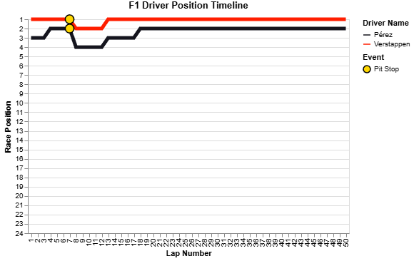

<strong style="color: #FF1E00;">Red Bull</strong> Race Timeline - Saudi 2024

:::

::: {.column width="47%"}
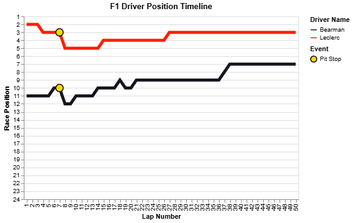

<strong style="color: #FF1E00;">Ferrari</strong> Race Timeline - Saudi 2024

:::
:::
:::

In contrast, <strong style="color: #FF1E00;">Mclaren</strong> and <strong style="color: #FF1E00;">Mercedes</strong> employed a more staggered pit stop strategy during the same race. For both teams, one driver made an early stop, similar to Red Bull and Ferrari, and stayed out on the track for the rest of the race. However, their second drivers followed a different approach, making their sole pit stop much later, closer to the final laps. This suggests a deliberate attempt to split strategies within the team, potentially to hedge against changing race conditions, safety car deployments, or tire degradation patterns. The visualizations highlight how this variation in timing affected driver positions and overall race dynamics.
@cr-TeamLevel2

:::{#cr-TeamLevel2}

:::{.columns}

::: {.column width="47%"}
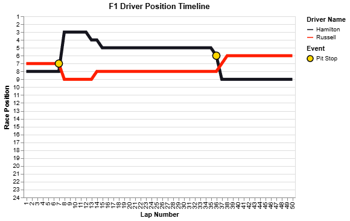

<strong style="color: #FF1E00;">Mercedes</strong> Race Timeline - Saudi 2024

:::

::: {.column width="47%"}
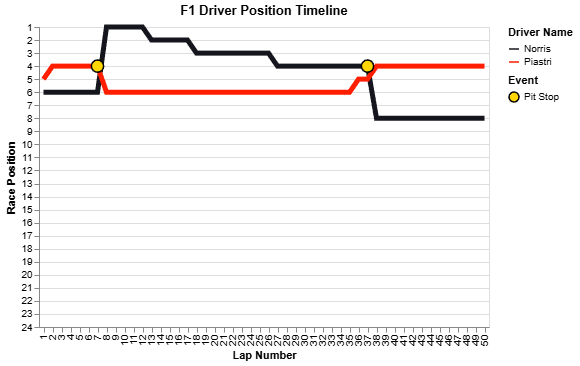

<strong style="color: #FF1E00;">Mclaren</strong> Race Timeline - Saudi 2024

:::
:::
:::

::::

<strong style="color: #FF1E00;">Pit Stop Efficiency</strong> refers to how quickly a Formula 1 team can perform a pit stop, which includes tire changes and any necessary adjustments. High efficiency minimizes the time the car spends stationary and reduces the risk of errors, such as loose wheels or penalties for unsafe releases. Teams train extensively to achieve sub-3-second stops, and even tenths of a second can make a difference in a tightly contested race. Superior pit stop execution not only supports on-track performance but can also be the deciding factor in closely fought battles, making it a vital component of race strategy.
@cr-TeamLevel4

The visualization below presents a linked view illustrating the relationship between pit stop times and team performance in Formula 1. On the left, a histogram displays the distribution of pit stop durations. On the right, a bar chart highlights the podium finishes for the selected team in the chosen year, showing how constructor performance aligns with pit stop efficiency. Users can operate the dropdown menus to adjust the year and driver selections, offering flexibility in exploring different patterns. The purpose of this plot is to highlight the correlation between stronger-performing teams and generally lower pit stop times, as evidenced by the horizontal placement of the distribution's center.

 

<figure style="text-align: center;">
  <iframe
    data-external = "1"
    src = "https://corcoran.georgetown.domains/5200_large_plots/pit_stop_duration_distribution.html"
    width = "840px"
    height = "575px"
    scrolling = "no"
    style = "border:none; display:block; overflow:hidden; background-color: white;"
  ></iframe>
  <figcaption style="margin-top: 8px; font-size: 14px; color: white;">
    Pit Stop Duration Distribution and Podium Finishes Linked View
  </figcaption>
</figure>

::::{.cr-section}

In the 2023 season, <strong style="color: #FF1E00;">Red Bull's</strong> pit stop duration distribution is centered around approximately 20 seconds, demonstrating their efficiency in executing quick stops. This consistency in pit strategy is reflected in their race success, as they secured an impressive 28 podium finishes throughout the season—the highest among all teams. The strong correlation between their optimized pit stop performance and podium finishes underscores the importance of rapid and precise pit stops in maintaining competitive dominance in Formula 1.
@cr-TeamLevel3

:::{#cr-TeamLevel3}

  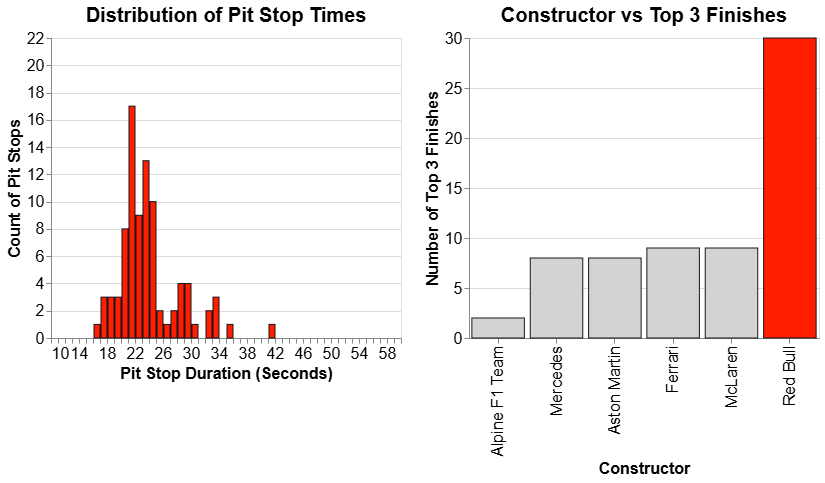{width="100%"}
   
  
Distribution of pit stop times in seconds for Red Bull, the 2023 Constructors’ Championship winners

:::

<strong style="color: #FF1E00;">Haas F1</strong>, the last-place finisher in the 2023 F1 Constructors' Championship, exhibits a noticeable rightward shift in its pit stop duration distribution compared to Red Bull. This shift suggests that Haas generally had longer pit stops, which could have contributed to their overall race struggles. Unlike Red Bull, which efficiently managed their pit stops and secured 28 podium finishes, Haas failed to reach the podium in any race throughout the season. The stark contrast between the two teams highlights the competitive disadvantage Haas faced, where slower pit stops potentially compounded performance gaps and prevented them from contending for top positions. This visualization reinforces how pit stop efficiency plays a crucial role in race outcomes, with Haas' longer stops reflecting their struggles in maintaining a competitive edge.
@cr-TeamLevel4

:::{#cr-TeamLevel4}

  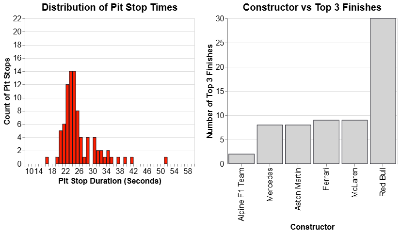{width="100%"}
   
  
Distribution of pit stop times in seconds for last place finishing Haas F1 in 2023

:::

::::

  

# Driver-Level Influences

In Formula One, individual driver performance is a critical factor that shapes the outcome of each race. Drivers must do far more than simply drive fast—they are responsible for optimizing lap times, managing tire wear, and adapting in real time to dynamic race conditions such as changing weather, safety car deployments, or on-track incidents. Success in F1 demands a careful balance of strategic decision-making, technical precision, physical stamina, and mental focus.

This section offers three interactive visualizations that highlight how driver behavior and skill manifest in lap time performance:

* <strong style="color: #FF1E00;">Lap Time Distributions by Driver:</strong> Boxplots that compare each driver's lap times across different tracks.

* <strong style="color: #FF1E00;">Lap Time Evolution per Race:</strong> Line plots tracking lap-by-lap performance within a single Grand Prix.

* <strong style="color: #FF1E00;">Performance across Grid - Positions by Driver:</strong> Surface plot showing distribution of results at every grid spot and finishing position, across each driver's career.

 

<strong style="color: #FF1E00;">Lap Time Distribution</strong>

The lap time distribution boxplots provide insight into each driver's consistency and adaptability across different circuits. The interactive plot below illustrate how lap times vary due to a combination of factors, including driver skill and experience, circuit characteristics, driving style, physical and mental condition, and the quality of communication and feedback between the driver and their race engineers.

Shorter whiskers indicate that most of a driver’s lap times fall within a narrow range, suggesting consistent performance overall. Longer whiskers imply a greater spread in lap times, possibly reflecting variability in race conditions or changes in car setup.

A shorter box (interquartile range) shows that a driver is highly consistent from lap to lap. A longer box suggests higher variability, which might occur due to fluctuating race conditions or differing tactical approaches.

<figure style="text-align: center;">
  <iframe
    data-external = "1"
    src = "https://corcoran.georgetown.domains/5200_large_plots/lap_time_consistency.html"
    width = "875px"
    height = "650px"
    frameborder = "0"
    allowfullscreen
    scrolling = "no"
    style = "border:none; display:block; overflow:hidden;"
  ></iframe>
<figcaption style="margin-top: 8px; font-size: 14px; color: white;">
      Lap Time Consistency Box Plots
  </figcaption>
</figure>

::::{.cr-section}
Comparing the lap time distribution of two greats of the sport can reveal a lot. <strong style="color: #FF1E00;">Max Verstappen</strong> is the current reigning World Champion, winning the last 4 consecutive titles. <strong style="color: #FF1E00;">Lewis Hamilton</strong> has previously won this honor 7 times, a joint top record. The Italian Grand Prix held at Monza is widely regarded as one of the hardest tracks in the competition. Verstappen has a lower median lap time, just under 86 seconds, and a shorter range of 8 seconds (from about 82 to 90 seconds). On the other hand, Hamilton's median lap time is about 87 seconds, and he has a longer range of 11 seconds (from about 82 to 93 seconds). This head-to-head comparison that on average, Verstappen's lap times are more consistent and faster than that of his British counterpart for the Italian Grand Prix. 
@cr-DriverLevel1

:::{#cr-DriverLevel1}

:::{.columns}

::: {.column width="47%"}
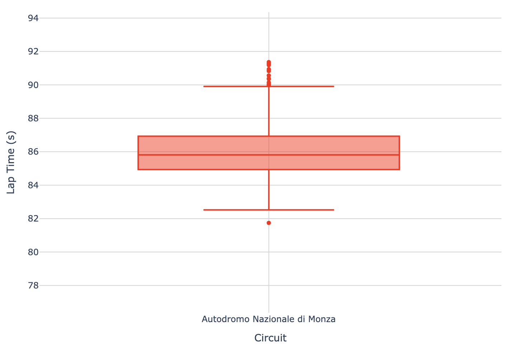

<strong style="color: #FF1E00;">Verstappen</strong> Lap time Boxplot for Monza

:::

::: {.column width="47%"}
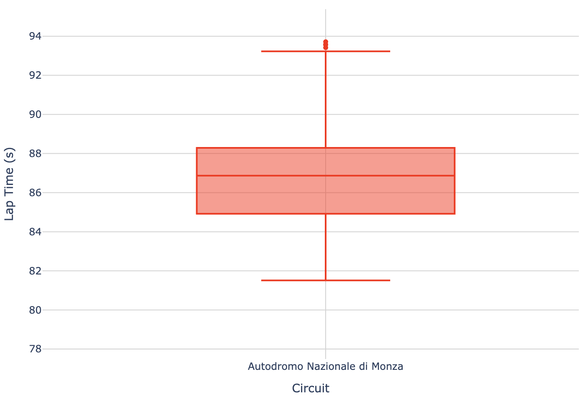

<strong style="color: #FF1E00;">Hamilton</strong> Lap time Boxplot for Monza

:::
:::
:::
::::

<strong style="color: #FF1E00;">Lap Time Evolution</strong>

The lap time evolution plots allow users to explore how a driver's pace changes over the course of a race. These visualizations can highlight strategic elements such as tire management, fuel load reduction, and the timing of overtakes or pit stops. Pit stops are marked with black triangles, which occur at the end of the lap. 

Generally, lap times decrease gradually as the race progresses. This trend reflects the highly competitive speeds F1 drivers must reach. However, anomalies such as mechanical issues, traffic, or incidents can disrupt these patterns. The first lap of the race and the laps following pit stops tend to be longer than average due to accelerating from the starting position or rejoining the race at lower momentum. Pace drop-off before a pit stop suggests tire wear or possibly other mechanical issues. Additionally, if lap times improve quickly after a pit stop, it suggests a successful pit stop tire strategy. Lastly, an irregular spikes or slow laps without stops could be due to overtaking battles with other drivers and traffic effects of being blocked by other vehicles. 

<figure style="text-align: center;">
  <iframe
    data-external = "1"
    src = "https://corcoran.georgetown.domains/5200_large_plots/lap_time_evolution_dropdown.html"
    width = "935px"
    height = "900px"
    frameborder = "0"
    allowfullscreen
    scrolling = "no"
    style = "border:none; display:block; overflow:hidden;"
  ></iframe>
  <figcaption style="margin-top: 8px; font-size: 14px; color: white;">
      Lap Time Evolution Line Plots
  </figcaption>
</figure>

  

<strong style="color: #FF1E00;">Performance Across Grid Positions</strong>

The performance across grid positions surface plot allows you to explore each driver's career results as a distribution of grid starting position and the race finishing position. The color encoding helps users understand if a driver performed relatively better or worse than the aggregate of all drivers at each position. Dropping positions compared to starting place is also shown as performing worse relatively.

Exploring each driver's results helps understand the positions they achieve better results at. Stalwarts like Lewis Hailton, Max Verstappen perform significantly better than the rest at pole positions. While most others, have some sweet spots and positions they perform poorly at.

<figure style="text-align: center;">
  <iframe
    data-external="1"
    src="https://corcoran.georgetown.domains/5200_large_plots/positional_advantage.html"
    width="600px"
    height="600px"
    frameborder="0"
    allowfullscreen
    scrolling="no"
    style="border:none; display:block; overflow:hidden;"
  ></iframe>
  <figcaption style="margin-top: 8px; font-size: 14px; color: white;">
    Positional Advantage for Race Starting Position Surface Plots
  </figcaption>
</figure>

  

# References

1. Ergast Developer API. [https://ergast.com/mrd/db/](https://ergast.com/mrd/db/)  
2. FastF1 API. [https://docs.fastf1.dev/examples/index.html](https://docs.fastf1.dev/examples/index.html)  
3. OpenF1 API. [https://openf1.org/#introduction](https://openf1.org/#introduction)
4. Formula 1: Drive to Survive 2025 Release Poster. [[https://www.formula1.com/en/latest/article/netflix-announce-release-date-for-drive-to-survive-season-7.6obw2eQX2Y3Jd2ZikunKT5]](https://www.formula1.com/en/latest/article/netflix-announce-release-date-for-drive-to-survive-season-7.6obw2eQX2Y3Jd2ZikunKT5)
