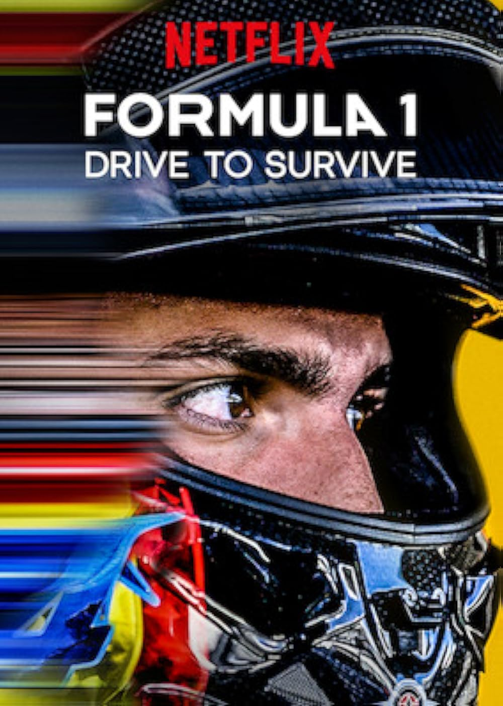
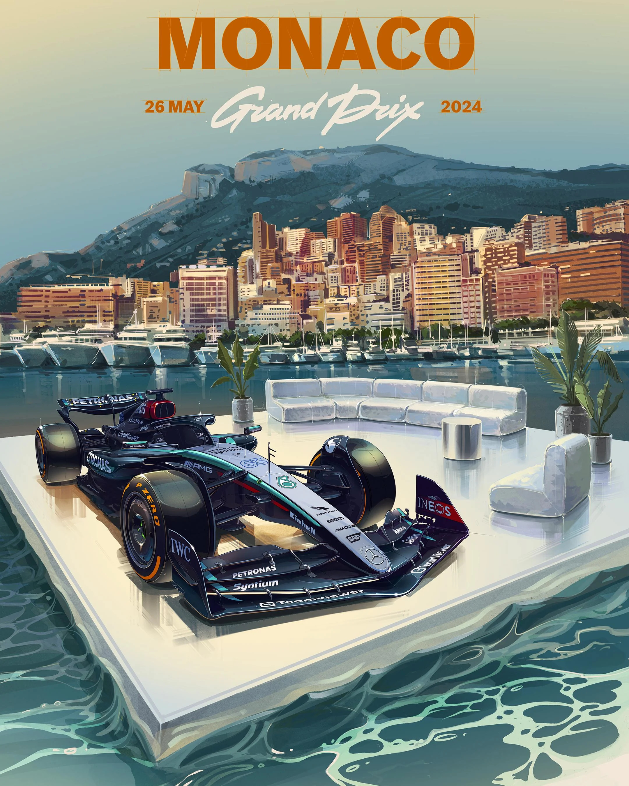
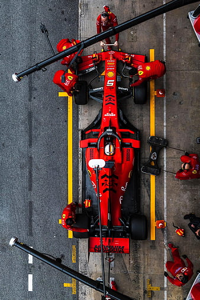

## Introduction

:::: columns
::: {.column width="60%"}
- Formula 1 has seen a surge in global popularity over the past decade  
- Once a niche motorsport, now a mainstream global spectacle  
- Netflix’s *Formula1: Drive to Survive* played a key role in expanding the audience  
- Humanized drivers, amplified rivalries, and revealed behind-the-scenes drama  
:::

::: {.column width="40%"}

:::

::::

---

## Rise in Popularity

<figure style = "display: flex; flex-direction: column; align-items: center; width: 100%">
  <iframe src = "./img/google_searches_over_time.html" width = "85%" height = "490px" frameborder = "0" scrolling = "no" style = "border: none; overflow: hidden;"></iframe>
  <figcaption style = "margin-top: 0.5rem;"><strong>Figure 2:</strong> Google searches related to Formula 1 over the last 10 years.</figcaption>
</figure>

---

## Track-Level Influences

:::: columns
::: {.column width="60%"}
- **Layout:** Varying circuit designs from tight street tracks to high-speed power circuits
- **Technicality:** Different cornering demands and precision requirements per track 
- **Environment:** Surface conditions, weather, and elavation changes
- **Physical Toll:** G-Forces and driver endurance demands vary by circuit 
:::

::: {.column width="40%"}

:::

::::

---

## Geospatial Track Maps

---

## Climate Considerations

---

## Team-Level Influences

:::: columns
::: {.column width="60%"}
- **Pit Stop Efficiency:** Quick tire changes help maintain track positions, or limit postion losses.
- **Pit Stop Timing:** Strategic pit stops based on tire wear, weather, track conditions, and competitor movements.
- **Car Setup:** Adjustments made to optimize performance for each track's unique characteristics and conditions.
:::

::: {.column width="40%"}

:::

::::

---

## Pit Stop Duration

---

## Pit Stop Timing

<iframe
  data-external = "1"
  src = "https://corcoran.georgetown.domains/5200_large_plots/index.html"
  width = "100%"
  height = "100%"
  frameborder = "0"
  allowfullscreen
  style = "border:none; max-width:100%; margin:0 auto; display:block;"
></iframe>

---

## Driver-Level Influences

:::: columns
::: {.column width="60%"}
- **Lap Times**: Drivers aim for optimal speed while balancing tire wear and track conditions.
- **Starting Position:** Strong qualifying positions provide an advantage in race strategy and overtaking opportunities.
:::

::: {.column width="40%"}

:::

::::

---

## Lap Time Consistency

:::: columns
::: {.column width="50%"}
- **Factors:** A driver's lap times are highly dependent on myriad of factors
  - Skills & experience
  - Track length 
  - Driving style
  - Physical & mental state
  - Feedback & communication with team
:::

::: {.column width="50%"}

:::

::::

---

## The margins for victory are razor thin

:::: columns
::: {.column width="50%"}

:::

::: {.column width="50%"}

:::

::::

---

## Lap times decrease over time

:::: columns
::: {.column width="50%"}

:::

::: {.column width="50%"}

:::

::::

---

## Qualifying Race Impact

---

## References

---

